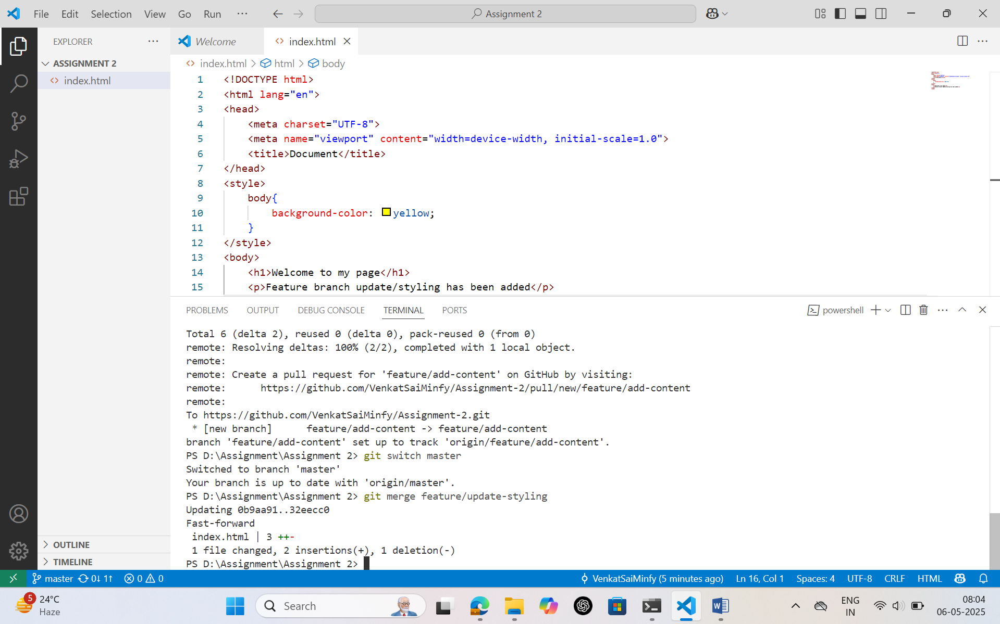

## Screenshots
# Merging feature/update-styling into main branch

# Merge Conflict raised while merging feature/add-content into main branch

# Merge Conflict resolved

## Description of solving the merge conflict
There was a conflict in the index.html file because both branches modified the same sections:
One branch changed the background color to yellow and added a styling update message.
The other branch changed the background color to skyblue and added a content update message.

To resolve the conflict:
I kept the background color as skyblue (from feature/add-content).
I included both paragraphs from each feature branch to preserve all content.

